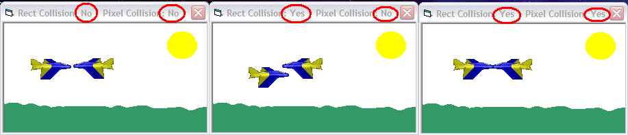



## Collision detection for games written in machine code

### Description

This is a DLL (full source included) written in pure assembly which will detect a collision between 2 sprites given their masks to the pixel. Because it is written in assembly, it is extremely fast. The fastest I got for 1 call on my 1.65 GHz was 2 milliseconds. The slowest being 11 milliseconds. You can use it outwith VB if you want (VB Calls to the DLL are slow). This is the second submission with some optmiization and also I fixed a bug whereby it raised an access violation when used with compiled exe's. If you like it, please vote and leave some feedback. ;)
 
### More Info
 

             |
---                |---
**Submitted On**   |2002-11-01 14:00:06
**By**             |[IRBMe](https://github.com/Planet-Source-Code/PSCIndex/blob/master/ByAuthor/irbme.md)
**Level**          |Intermediate
**User Rating**    |4.7 (66 globes from 14 users)
**Compatibility**  |VB 5\.0, VB 6\.0
**Category**       |[Games](https://github.com/Planet-Source-Code/PSCIndex/blob/master/ByCategory/games__1-38.md)
**World**          |[Visual Basic](https://github.com/Planet-Source-Code/PSCIndex/blob/master/ByWorld/visual-basic.md)
**Archive File**   |[Collision\_1490341112002\.zip](https://github.com/Planet-Source-Code/irbme-collision-detection-for-games-written-in-machine-code__1-40321/archive/master.zip)

